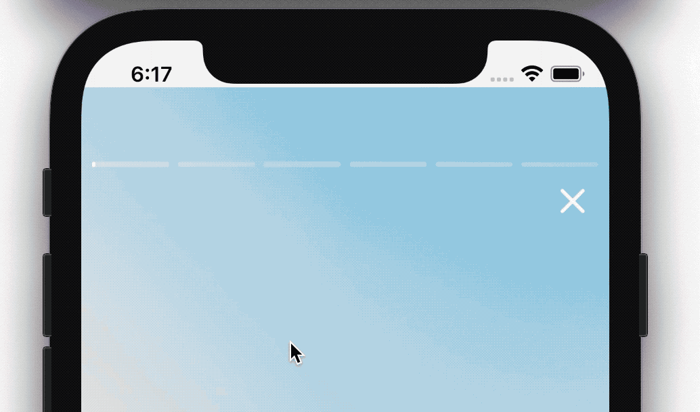

# Instagram Story - Using Blueprint & OpenCombine

Declaratively UI constructed popular Instagram Scrolling Photos with some improvements for iOS, written in Swift.

## About
This tutorial demonstrates two ways of showing stories:

>- simple:

>- customized (with labels and buttons on each slide):

## Architecture

Based on [Blueprint](https://github.com/square/Blueprint) and [OpenCombine](https://github.com/OpenCombine/OpenCombine) with MVVM architecture. 

## Requirements

- iOS 11 or later

## Special thanks

This app uses [Blueprint](https://github.com/square/Blueprint) by [Square team](https://github.com/square) and [OpenCombine](https://github.com/OpenCombine/OpenCombine) by [OpenCombine team](https://github.com/OpenCombine).

Thx to [Jean-Marc Boullianne](https://github.com/jboullianne) for inspriration with his [SwiftUI tutorial of stories](https://github.com/jboullianne/InstagramStoryTutorial-SwiftUI).
